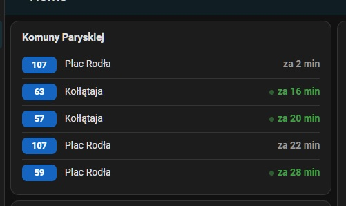

# ZDiTM Departures Card

[](https://hacs.xyz)
[](https://github.com/GreatAnubis/zditm-departures-card/releases)

Karta Lovelace dla Home Assistant pokazująca **odjazdy autobusów i tramwajów ZDiTM Szczecin na żywo** —
za ile minut następny i kilka kolejnych, z kolorami wg typu linii.
Dane: [ZDiTM Szczecin API](https://www.zditm.szczecin.pl) (CC0).



## Funkcje

- ⏱️ Odjazdy na żywo (GPS): „za X min" / „teraz", z fallbackiem na rozkład
- 🔄 Czas przełącza się automatycznie między godziną a „za ile minut"
- 🟢 Kolory plakietek wg typu linii (tramwaj / autobus / pośpieszny / nocny / zastępczy)
- 🔎 Wyszukiwarka przystanku w edytorze z podglądem kierunku na żywo
- 🗺️ Wybór przystanku na interaktywnej mapie (edytor karty)
- 🎛️ Filtr linii i kierunku, tryby `list` / `compact`, konfigurowalne odświeżanie
- 🔌 Tryb integracji HA: czyta z encji [hass-zditm-szczecin](https://github.com/GreatAnubis/hass-zditm-szczecin) (`entity:`) — jedno źródło danych
- 🎨 Dopasowuje się do motywu Home Assistant

## Instalacja (HACS)

1. HACS → Frontend → menu (⋮) → **Custom repositories** → dodaj URL repo, typ **Dashboard/Plugin**.
2. Zainstaluj „ZDiTM Departures Card".
3. (Jeśli nie doda się samo) Ustawienia → Dashboardy → Zasoby → dodaj
   `/hacsfiles/zditm-departures-card/zditm-departures-card.js` jako **JavaScript Module**.

## Konfiguracja

Dodaj kartę przez UI („Dodaj kartę" → ZDiTM Departures) lub w YAML:

```yaml
type: custom:zditm-departures-card
stop: "10111"        # numer słupka (wyszukasz w edytorze po nazwie)
lines: [75, 521]     # opcjonalnie: filtr linii (puste = wszystkie)
mode: list           # list | compact
count: 3             # ile odjazdów (tryb list)
```

### Tryb integracji Home Assistant (encje)

Jeśli masz zainstalowaną integrację [hass-zditm-szczecin](https://github.com/GreatAnubis/hass-zditm-szczecin),
karta może czytać dane z encji sensora „następny odjazd" zamiast odpytywać API bezpośrednio
(jedno źródło danych, mniej zapytań). Podaj `entity` zamiast `stop` — cała reszta funkcji
(`mode`, `count`, `lines`, `directions`, przełączanie czasu, kolory) działa tak samo:

```yaml
type: custom:zditm-departures-card
entity: sensor.brama_portowa_nastepny_odjazd
mode: list
count: 3             # 1, 2, 3 … lub duża wartość, aby pokazać wszystkie
```

| Pole | Domyślnie | Opis |
|------|-----------|------|
| `stop` | — (wymagane, jeśli brak `entity`) | Numer słupka (tryb API) |
| `entity` | — (wymagane, jeśli brak `stop`) | Encja sensora integracji (tryb HA) |
| `title` | nazwa z API | Nagłówek karty |
| `lines` | wszystkie | Filtr linii |
| `directions` | wszystkie | Filtr kierunku (fragment nazwy) |
| `mode` | `list` | `list` lub `compact` |
| `count` | `3` | Liczba odjazdów (tryb list) |
| `refresh` | `30` | Sekundy między odświeżeniami (min 20; tylko tryb `stop`) |
| `show_header` | `true` | Pokaż nagłówek |
| `tram_lines` | 1–11 | Nadpisanie klasyfikacji tramwaj/autobus |
| `flip_clock_secs` | `10` | Ile sekund pokazywać godzinę przy przełączaniu |
| `flip_rel_secs` | `5` | Ile sekund pokazywać „za X min" przy przełączaniu |

## Kolory linii

Kolor plakietki wynika z typu linii pobranego z API ZDiTM (`/lines`):

- 🟢 tramwaj (1–11)
- 🔵 autobus zwykły
- 🔴 pośpieszny (A, B, C)
- ⬛ nocny (5xx)
- 🟠 zastępczy (8xx)

Czas każdego odjazdu przełącza się automatycznie między godziną a „za ile minut".
